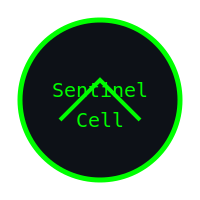
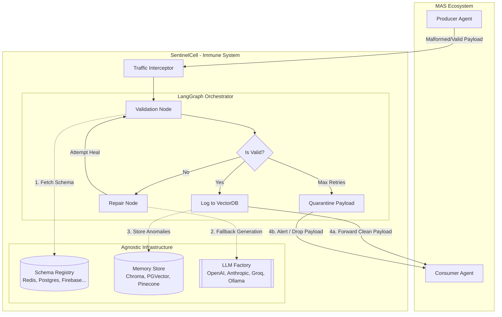

<div align="center">
  
  <h1>SentinelCell - MAS Immune System</h1>

  
  
  
  
  

  <!-- Infrastructure & Observability Badges -->
  
  
  
  
  

  <!-- LLM Provider & Framework Badges -->
  
  
  
  
  
  
  
</div>

## Table of Contents
- [1. Introduction (Problem Statement)](#1-introduction-problem-statement)
- [2. Solution (Our Proposal)](#2-solution-our-proposal)
- [3. Architecture (Agentic Architecture)](#3-architecture-agentic-architecture)
- [4. Core Features](#4-core-features)
- [5. Setup & Deployment](#5-setup--deployment)
- [6. Live Examples & Demos](#6-live-examples--demos)
- [7. Documentation & Policies](#7-documentation--policies)

---

## 1. Introduction (Problem Statement)
Multi-Agent Systems (MAS) rely on fragile, hardcoded communication contracts. When an agent hallucinates or updates its output format, the entire pipeline crashes. There is no centralized authority or "Immune System" to gracefully intercept, detect, and automatically heal semantic breaches before they corrupt downstream consumers.

## 2. Solution (Our Proposal)
**SentinelCell** is an intelligent middleware—an "Immune System"—for MAS. It intercepts inter-agent traffic in real-time, validates the data against a centralized SchemaRegistry (powered by MCP), and automatically repairs any malformed JSON payloads.

The orchestration is powered by **LangGraph**, providing a resilient, model-agnostic state machine with built-in cloud-to-local fallback mechanisms.

### Philosophy
The "Vibe" of SentinelCell is robust resilience wrapped in a futuristic, "Hackerman" aesthetic. It turns silent pipeline failures into observable, self-correcting defense mechanisms.

---

## 3. Architecture (Agentic Architecture)



---

## 4. Core Features

| Feature | Description | Stack / Tech |
|---------|-------------|--------------|
| **Model Agnostic Fallback** | Seamless fallback if an LLM provider fails. | OpenAI, Anthropic, Groq, DeepSeek, Gemini, Ollama |
| **Database Agnostic Memory** | Adaptive RAG decoupled from underlying storage. | ChromaDB, PGVector, Pinecone, In-Memory |
| **Agnostic Log Sink** | Multi-destination logging (Console, File, ELK). | `rich`, `elasticsearch-py` |
| **Time-Series Telemetry** | Success/Failure rates and Latency tracking. | Prometheus, Grafana, FastAPI `/metrics` |
| **MCP Schema Registry** | Centralized, dynamic schema validation. | Model Context Protocol (MCP) |
| **Hybrid Gateway** | SDK, FastAPI, Redis MQ, or Envoy proxy support. | Redis, FastAPI, Envoy |

### 🔄 Model Agnostic Fallback (LLMFactory)
SentinelCell does not rely on a single point of failure. If OpenAI is down, it seamlessly falls back to Anthropic, Groq, or Local Ollama based on your environment configurations.
*See details in [docs/langchain_models.md](docs/langchain_models.md).*

### 💾 Database Agnostic Memory (VectorDBFactory)
Our Adaptive RAG engine is fully decoupled from the underlying storage. You can seamlessly switch between **ChromaDB**, **PostgreSQL (PGVector)**, **Pinecone**, or **In-Memory** datastores simply by updating your environment variable.
*See details in [Vector Database Setup](docs/vector_databases.md) and [ADR 004](ADR/adr-004-database-agnostic-memory.md).*

### 📊 Agnostic Logger & Time-Series Telemetry
- **Log Sink Pattern**: Terminal logs (`rich` format) fan-out to local text files and remote **Elasticsearch** clusters simultaneously.
- **Prometheus Export**: Tracks payload intercepts, self-healing success rates, quarantine drops, and LLM processing latency via a `/metrics` endpoint.
*See details in [Agnostic Logger Docs](docs/agnostic_logger.md).*

### 🛡️ Strict Container Security
Agents run within a fortified Docker Sandbox obeying the Principle of Least Privilege:
- **0.5 vCPU** & **512MB RAM** hard limits to prevent runaway agents.
- **Read-Only root filesystem** ensuring the environment cannot be tampered with.
- **Drop All Capabilities** to prevent privilege escalation.
*See our [Container Policy](container_policy.md) and [Docker Setup](docs/docker_setup.md).*

### 🔌 MCP Schema Registry
Semantic validation isn't hardcoded. SentinelCell queries a centralized Model Context Protocol (MCP) server dynamically to enforce the correct contract for the target agent.

### 🌉 Hybrid Deployment Architecture
SentinelCell adapts to your environment constraints with several powerful modes:
1. **Middleware Mode (SDK)**: Tight integration for low-latency agent loops.
2. **Guardian Mode (FastAPI Gateway)**: A reverse proxy for transparent legacy agent protection.
3. **Asynchronous Mode (Redis MQ Worker)**: A background worker listening to message queues for distributed systems.
4. **Transparent Proxy (Envoy)**: Layer 7 interception with zero code changes in your agents.
*Read our [Deployment Strategies](docs/deployment_strategies.md) for a deep dive.*

---

## 5. Setup & Deployment

### Environment Configuration
To ensure the model-agnostic Self-Healing engine operates correctly, configure your environment variables:
```bash
cp .env.example .env
```
Edit `.env` and set your preferred fallback priority order:
```env
PROVIDER_ORDER=OPENAI,GROQ,LOCAL_OLLAMA,ANTHROPIC

OPENAI_API_KEY=your_openai_key_here
ANTHROPIC_API_KEY=your_anthropic_key_here
GROQ_API_KEY=your_groq_key_here
# Ollama runs locally, usually on http://localhost:11434
```

### Option A: Local Execution
```bash
# Setup the environment
python -m venv .venv
source .venv/bin/activate
pip install -r requirements.txt

# Run the SchemaRegistry MCP Server in background
python src/mcp_server.py &
```

### Option B: Secure Docker Execution (Hybrid Gateways)
SentinelCell is fully containerized. Running the compose file spins up the **FastAPI Gateway**, **Redis MQ Worker**, **Envoy Proxy**, and **Redis** instance simultaneously within the secure sandbox defined by our policies:
```bash
docker compose up -d --build
docker stats # To verify strict CPU/RAM limits on the SentinelCell gateways
```

---

## 6. Live Examples & Demos

We provide live simulations showing the Immune System in action. Once your `.env` is ready, run these from the root directory.

*Be sure to read the comprehensive **[Examples Documentation](examples/README.md)** for architecture diagrams and I/O examples of each simulation.*

### Core Capabilities Simulations
- **🐒 Chaos Monkey Simulation**: `PYTHONPATH=. python examples/chaos_monkey.py`
- **🛡️ Adversarial Security Injection**: `PYTHONPATH=. python examples/security_injection_demo.py`
- **⏱️ Latency & Performance Benchmark**: `PYTHONPATH=. python examples/latency_benchmark.py`
- **🚦 MQ Distributed Architecture Demo**: `PYTHONPATH=. python examples/mq_simulation_demo.py`
- **🛑 Emergency Quarantine Mode**: `PYTHONPATH=. python examples/quarantine_mode_demo.py`

### Basic Integration Demos
- **Basic Validation & Healing**: `PYTHONPATH=. python examples/basic_usage.py`
- **Producer-Consumer Interception Flow**: `PYTHONPATH=. python examples/multi_agent_flow.py`
- **Custom Security Skills (Sanitizer)**: `PYTHONPATH=. python examples/custom_skill_demo.py`

---

## 7. Documentation & Policies

### 📖 Technical Docs

Explore our detailed documentation for a deeper dive:
- **[Examples & Simulations](examples/README.md):** Interactive workflows and demos.
- **[Deployment Strategies](docs/deployment_strategies.md):** Standalone, Proxy, and Async designs.
- **[Docker Setup](docs/docker_setup.md):** Network topologies and compose guides.
- **[Testing & Coverage Guide](docs/testing_guide.md):** Information on unit tests and CI/CD pipelines.
- **[Vector Database Setup](docs/vector_databases.md):** Information on our Agnostic VectorDB connections.
- **[Schema Registry Setup](docs/schema_registry.md):** Information on our Agnostic MCP Registry connections.
- **[Agnostic Logger & Telemetry](docs/agnostic_logger.md)**: Log Sink implementations for Elasticsearch and Prometheus metrics.
- **[Supported LangChain Models](docs/langchain_models.md)**: Multi-provider fallback orchestration details.
- **[Architecture Decision Records (ADR)](ADR/)**: Deep dive into the Engineering Decisions and Rationale.

### ⚖️ Policies
SentinelCell enforces strict execution boundaries:
- **[Container Policy](container_policy.md)**: Resource limits and network isolation.
- **[Changelog Policy](.antigravity/auto_changelog_policy.md)**: AI-assisted safe committing.
- **[Readme Standards](.antigravity/readme_standards.md)**: Strict English documentation.

### 🛠️ Capability Matrix
Agentic capabilities are defined in `.antigravity/skills/`:
- **[Traffic Control](.antigravity/skills/traffic_control.md)**: Non-intrusive async interception.
- **[Self-Healing](.antigravity/skills/healing.md)**: LangChain-powered dynamic JSON recovery.
- **[MCP Registry](.antigravity/skills/mcp_registry.md)**: Centralized schema resolution.

---

### Acknowledgments & References
- Built for the **Kaggle AI Agents: Intensive Vibe Coding Capstone Project**.
- Powered by `rich` for the Hackerman aesthetic.
- [Model Context Protocol (MCP) Official Specs](https://modelcontextprotocol.io/)
- [LangGraph Documentation](https://langchain-ai.github.io/langgraph/)

> **Security Disclaimer:** Ensure your `.env` is properly secured and never commit API keys to version control. The agent treats all incoming traffic as untrusted until validated by the MCP SchemaRegistry.
