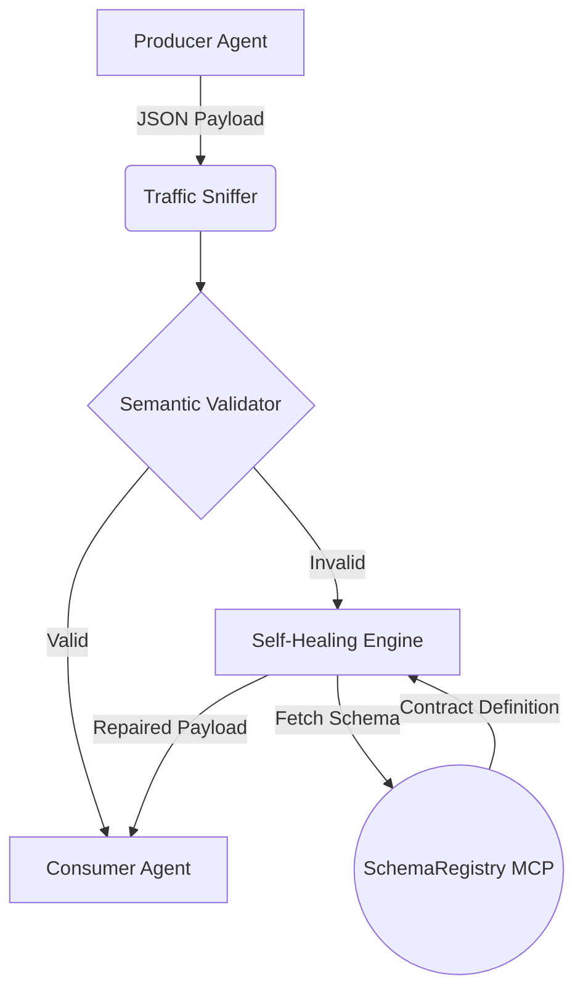

# SentinelCell - MAS Immune System


## 1. Introduction (Problem Statement)
Multi-Agent Systems (MAS) rely on fragile, hardcoded communication contracts. When an agent hallucinates or updates its output format, the entire pipeline crashes. There is no centralized authority or "Immune System" to gracefully intercept, detect, and automatically heal semantic breaches before they corrupt downstream consumers.

## 2. Solution (Our Proposal)
**SentinelCell** is an intelligent middleware—an "Immune System"—for MAS. It intercepts inter-agent traffic in real-time without introducing latency, validates the data against a centralized SchemaRegistry (powered by MCP), and automatically repairs any malformed JSON payloads using LLM inference (Self-Healing).

### Philosophy
The "Vibe" of SentinelCell is robust resilience wrapped in a futuristic, "Hackerman" aesthetic. It turns silent pipeline failures into observable, self-correcting defense mechanisms.

## 3. Architecture (Agentic Architecture)



## Setup & Deployment

```bash
# 1. Clone the repository
git clone https://github.com/your-username/SentinelCell.git
cd SentinelCell

# 2. Setup the environment
python -m venv .venv
source .venv/bin/activate
pip install rich pydantic jsonschema mcp python-dotenv

# 3. Configure environment variables
# MUST create .env and add API key for self-healing
echo "GEMINI_API_KEY=your_api_key_here" > .env

# 4. Run the SchemaRegistry MCP Server
python src/mcp_server.py &

# 5. Run the SentinelCell Sniffer Demo
python src/listener.py
```

## Capability Matrix & Skill Documentation
SentinelCell is equipped with several agentic capabilities defined in `.antigravity/skills/`:
- **[Traffic Control](.antigravity/skills/traffic_control.md)**: Non-intrusive async interception.
- **[Self-Healing](.antigravity/skills/healing.md)**: LLM-powered dynamic JSON recovery.
- **[MCP Registry](.antigravity/skills/mcp_registry.md)**: Centralized schema resolution using Model Context Protocol.
- **[Security Compliance](.antigravity/skills/security_compliance.md)**: Environment isolation and sanitization.

## Sandbox Policy
SentinelCell enforces strict execution boundaries. All agentic auto-commits and tests are verified within an Antigravity sandbox. No sensitive variables (`.env`) are ever exposed or committed.

> **Security Disclaimer:** SentinelCell interacts with external LLM APIs (e.g., Gemini) for self-healing. Ensure your `.env` is properly secured and never commit API keys to version control. The agent treats all incoming traffic as untrusted until validated by the SchemaRegistry.
