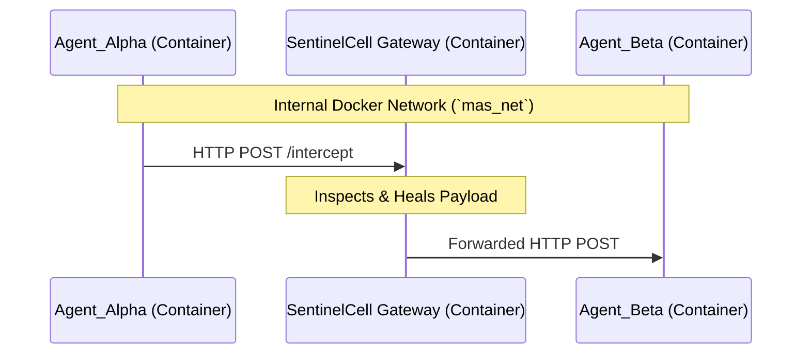
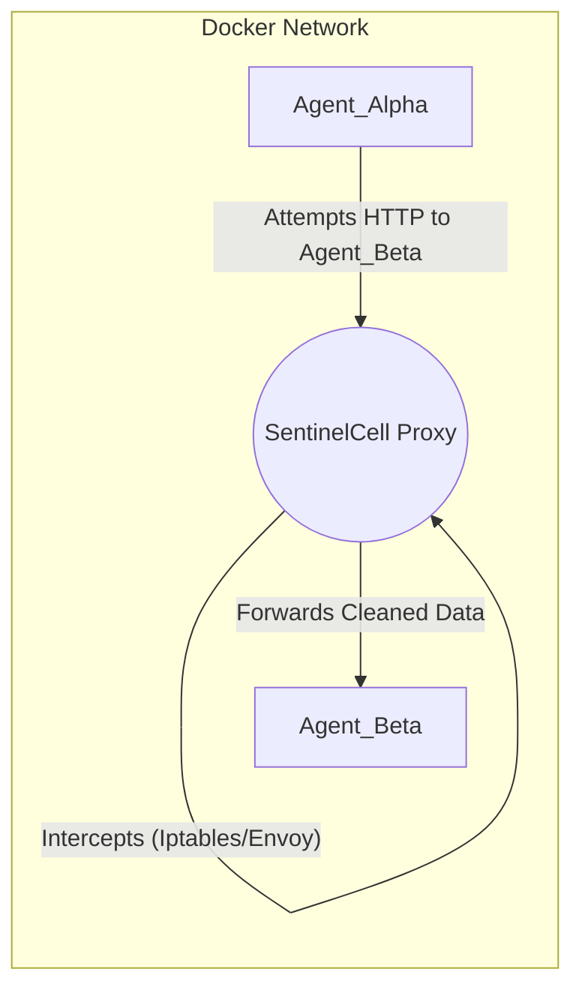

<div align="center">
  

  # SentinelCell: Docker & Container Orchestration

  
  
  

  *Deploy SentinelCell in highly restricted, isolated sandbox containers for enterprise-grade Multi-Agent System protection.*
</div>

---

## 🔒 Security and Resource Sandbox
Before deploying any topology, note that SentinelCell enforces strict container policies:
- **Hard Resource Caps**: Capped at **0.5 vCPU** and **512 MB RAM**.
- **Read-Only Root FS**: The container's core filesystem is immutable (`read_only: true`).
- **Privilege Drop**: Drops all root capabilities (`cap_drop: [ALL]`).
- **Ephemeral State**: Only `/logs` (persistent) and `/temp` (tmpfs) are writable.

---

## Deployment Topologies

SentinelCell can be orchestrated via Docker in three distinct network topologies:

---

### 1. Standalone Sandbox (SDK/Worker Mode)
**Best for:** Running SentinelCell as a background queue consumer or standalone SDK worker.

[](#)

**Architecture:**
```mermaid
graph TD
    subgraph Host OS
        A[Message Queue / Redis]
        B[Agent_Alpha]
    end
    subgraph Docker Sandbox (Read-Only)
        S((SentinelCell Worker))
    end
    A -- Reads/Writes --> S
    B -- Pushes to --> A
```

**Docker Compose (`docker-compose.yml`):**
```yaml
services:
  sentinelcell_worker:
    build: .
    container_name: sentinelcell_agent
    read_only: true
    cap_drop: [ALL]
    volumes:
      - ./logs:/logs
    command: python examples/mq_simulation_demo.py
```

---

### 2. Reverse Proxy Gateway (API Mode)
**Best for:** Centralized API Firewall. Agents sit on an internal Docker network, and all communication routes through SentinelCell.

[](#)

**Architecture:**


**Docker Compose Example:**
```yaml
networks:
  mas_net:
    internal: true # No internet access for agents

services:
  agent_alpha:
    image: my_agent:latest
    networks: [mas_net]

  agent_beta:
    image: my_agent:latest
    networks: [mas_net]

  sentinel_gateway:
    build: .
    ports:
      - "8000:8000"
    networks: [mas_net]
    command: uvicorn src.gateways.fastapi_gateway:app --host 0.0.0.0 --port 8000
```

---

### 3. Transparent Network Proxy (Envoy/Iptables)
**Best for:** Zero-code changes to Legacy Agents. Network traffic is hijacked at the Docker level and forced through SentinelCell.

[](#)

**Architecture:**


**Implementation Strategy:**
- Use `iptables` inside the Docker network namespace to route all traffic destined for `agent_beta:8080` to `sentinel_proxy:8000`.
- SentinelCell acts as a "Man-in-the-Middle" (MITM) Guardian.

```bash
# Example Iptables rule (run inside the Docker network)
iptables -t nat -A PREROUTING -p tcp --dport 8080 -j DNAT --to-destination <sentinel_ip>:8000
```

---

## 🛠️ Operational Commands

**Build and Start (Detached):**
```bash
docker compose up -d --build
```

**Live Hackerman Logs:**
```bash
docker compose logs -f
```

**Verify Sandbox Restrictions (Stats):**
```bash
docker stats sentinelcell_agent
```
