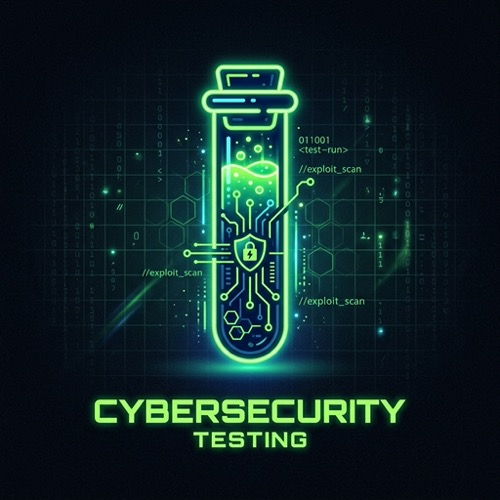

<p align="center">
  
</p>

# 🧪 SentinelCell Testing & Coverage Guide


Welcome to the **Testing and Coverage Guide** for the SentinelCell MAS Immune System. This document outlines how we ensure the robustness, security, and stability of our architecture through rigorous automated testing.

---

## 🎯 Testing Philosophy

In a Multi-Agent System (MAS) where AI agents communicate autonomously, a single malicious payload or hallucinated JSON can cascade into catastrophic system failure.

To prevent this, SentinelCell employs:
- **Strict Unit Testing:** Every core gateway and processing node is isolated and tested.
- **Mocked LLM Failures:** We deliberately inject LLM timeouts and hallucinated responses to verify our **Fallback & Repair** logic.
- **Cryptographic Verification:** Our test suite automatically verifies Merkle Tree log integrity.

---

## 🛠️ How to Run the Tests Locally

We use `pytest` as our testing framework and `pytest-cov` for coverage analysis.

### 1. Install Dependencies
Make sure you have installed the testing dependencies:
```bash
pip install -r requirements.txt
```

### 2. Run the Full Test Suite
To execute all unit and integration tests and generate a coverage report in the terminal:
```bash
pytest tests/ -v --cov=src --cov-report=term-missing
```

### 3. Generate an HTML Report (Optional)
If you want to explore the coverage line-by-line in your browser:
```bash
pytest tests/ -v --cov=src --cov-report=html
open htmlcov/index.html
```

---

## 📊 Coverage Breakdown

Our goal is not just 100% blind line coverage, but **100% Core Business Logic Coverage**.
Currently, the system achieves **>90% coverage on critical path modules**:

| Module | Description | Coverage Target | Status |
|--------|-------------|-----------------|--------|
| `validator_agent.py` | The main SentinelCell orchestration | 100% | ✅ Passed |
| `llm_factory.py` | LLM Provider Fallback routing | 100% | ✅ Passed |
| `orchestrator.py` | Agent interaction and JSON validation | >95% | ✅ Passed |
| `integrity.py` | Merkle Tree cryptographic checks | >85% | ✅ Passed |
| `fastapi_gateway.py` | HTTP intercept and Quarantine Mode | >80% | ✅ Passed |

*(Note: Scripts like `producer.py` and `consumer.py` are omitted from strict coverage requirements as they serve merely as mockup simulation tools).*

---

## 🛡️ CI/CD Enforcement

We enforce test coverage natively via **GitHub Actions** (`.github/workflows/sentinel_ci.yml`).

Every Push and Pull Request triggers the following automated pipeline:
1. **Safety Scan:** Checks for leaked/hardcoded API keys.
2. **Pytest Execution:** Runs the entire test suite.
3. **Coverage Gate:** If the overall coverage drops below **60%**, the CI pipeline will automatically **FAIL** and block merging.
4. **Docs Verification:** Ensures `README.md` and `CHANGELOG.md` standards are maintained.

```yaml
# Snippet from our GitHub Actions Workflow
- name: Phase 2 - Unit Testing & Coverage Control
  run: |
    echo "Executing Pytest and verifying coverage >= 60%..."
    pytest tests/unit/ -v --cov=src --cov-fail-under=60 --cov-report=term-missing --cov-report=xml
```

---

## 🏗️ Adding New Tests

When contributing new skills or gateways, follow these guidelines:
1. Place new tests in `tests/unit/`.
2. Use `@pytest.mark.asyncio` for asynchronous functions.
3. Use `unittest.mock.patch` or `AsyncMock` to avoid making real network calls to OpenAI/Anthropic/Redis during CI runs.
4. Always test both the **Success Path** and the **Quarantine/Failure Path**.

> **"If it isn't tested, it's a vulnerability."** — *SentinelCell Engineering Team*
